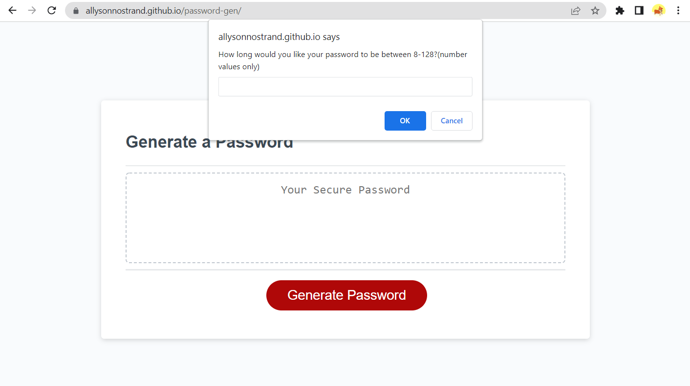
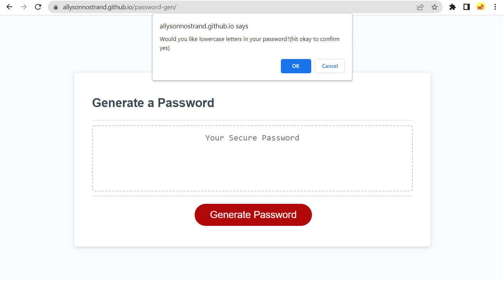
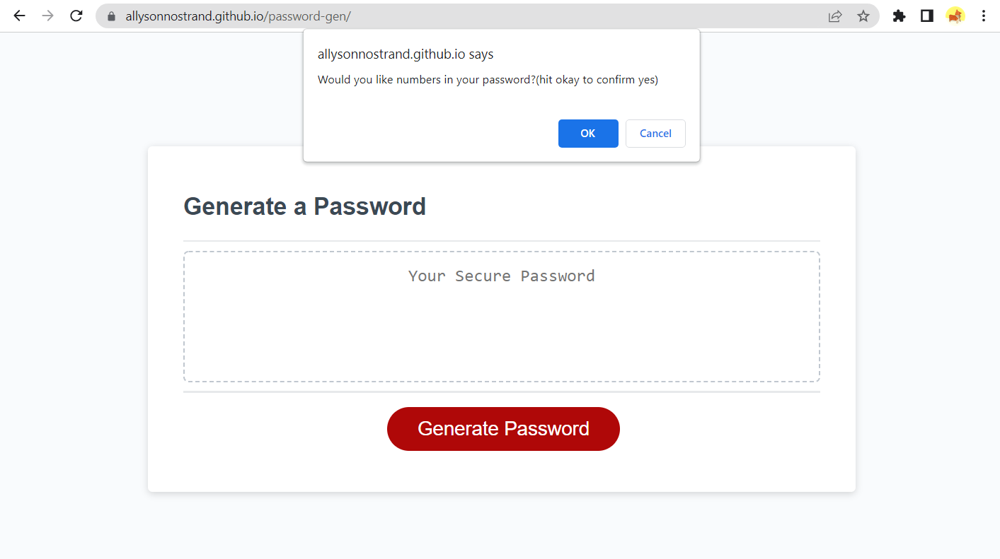
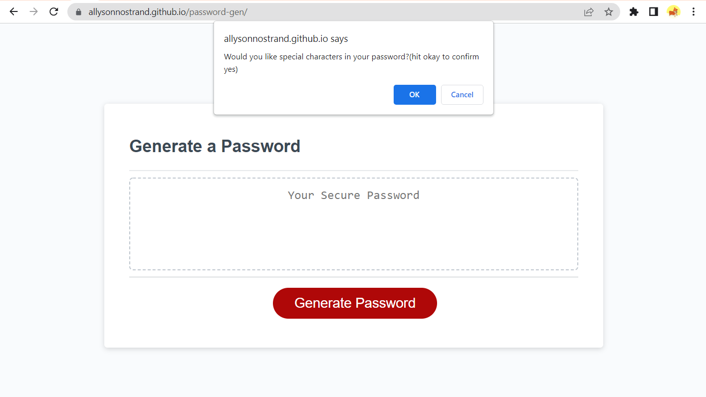
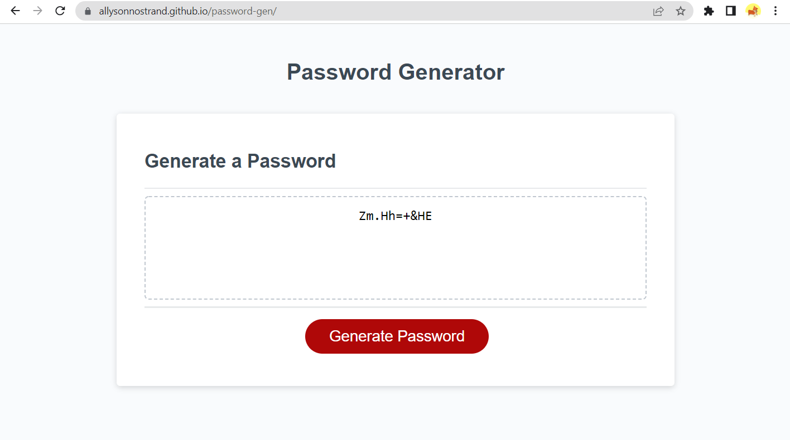

# password-gen

## Link 
Password Generator https://allysonnostrand.github.io/password-gen/

## Description

The goal for this assignment was to create a random password generator with a series of prompts to define what the user would like their password to include- like lowecase, uppercase, numbers and special characters. 

I started off by creating 5 different prompts. The first asking the user how long they'd like their password to be between 8 and 128 characters. Then, using the confirm method the user is prompted with yes or no questions regarding if they'd like to include lowercase, uppercase, numbers and special characters in the password. 

When the user selects ok to the prompts they would like, they become true and are stored in variables. These variables are used in the last function I made- generatePassword. In short terms, generatePassword takes all the data collected from the user, creates a string containing all the possible character types the user has selected, randomizes what characters in that string gets chosen corresponding with the input for how long the user would like the password to be- and finally returns the final password. 

# Screenshots

Here is the first prompt after clicking the generate password button. My input for this demo is 10 and I hit okay on all of the following.

Prompt 2

Prompt 3 

Prompt 4

Prompt 5

Password Generated!

